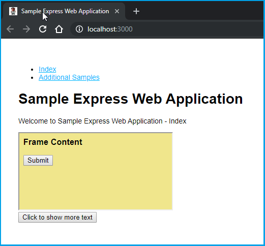

# Cucumber Boilerplate

Node.js WebdriverIO Selenium Cucumber Boilerplate

Functionalities Covered:

* WebdriverIO (https://webdriver.io/)
* Cucumber.js / Gherkin / BDD (https://cucumber.io/docs/installation/javascript/)
* Chromedriver / Local Testing (https://sites.google.com/a/chromium.org/chromedriver/)
* Selenium Grid / Remote Testing (https://www.seleniumhq.org/docs/07_selenium_grid.jsp)
* BrowserStack / Cloud Testing (https://www.browserstack.com/automate/webdriverio)

# WebdriverIO

Instead of using vanilla Node.js automated browser testing frameworks from scratch you can utilize a very handy set of orchestration libraries called "WebdriverIO" which bring together all those tools in a unified testing package. These libraries can be installed independently and used via "wdio.conf.js" files as entry points.

WebdriverIO API (ver. 5): https://webdriver.io/docs/api.html

Webdriver Protocol: https://webdriver.io/docs/api/webdriver.html

# Simple Usage

Open your favourite CLI, like Git Bash in Windows and run the following commands:
```shell script
# Create .env file with the BASE_URL
echo "BASE_URL=http://localhost:3000" > .env

# Installs dependencies
npm install

# Run "Sample Express App" in the background
npm start > express.log &

# Lints the JavaScript
npm run lint

# Runs the end-to-end testing using WebdriverIO Cucumber scenarios
npm test
```

Please see the specific `package.json` scripts and the `wdio-configs`
for details about running the tests locally using Chromedriver (with GUI or not) or
by delegating the testing effort to BrowserStack.

# Sample Express App

The "Sample Express App" is a standalone Node.js Express web application running at http://localhost:3000 that can be tested using Selenium. Sample screenshot below.



The views served by that application provide simple AJAX-like interaction and also an embedded iframe.

The Gherkin test scenarios in the [sample-cucumber.feature](features/sample-cucumber.feature) file rely on this application running in the background.

# Debugging

The recommended package for developing and debugging Cucumber scenarios is JetBrains WebStorm (https://www.jetbrains.com/webstorm/).
It has excellent Gherkin syntax support as well as easy run/debug configuration setup.

For debugging in VS Code (https://code.visualstudio.com/) you can use the following "launch" configuration:
```
{
    "version": "0.2.0",
    "configurations": [
        {
            "type": "node",
            "request": "launch",
            "name": "Debug Cucumber",
            "runtimeExecutable": "npm",
            "cwd": "${workspaceFolder}",
            "runtimeArgs": [
                "run",
                "chromedriver-cucumber"
            ],  
            "port": 5859,
            "env": {
                "DEBUG": "true" 
            }
        }
    ]
}
```
This specific one will start debugging the `chromedriver-cucumber` task. 
To use a different one defined in `package.json` you need to change the `runtimeArgs` second array value.
