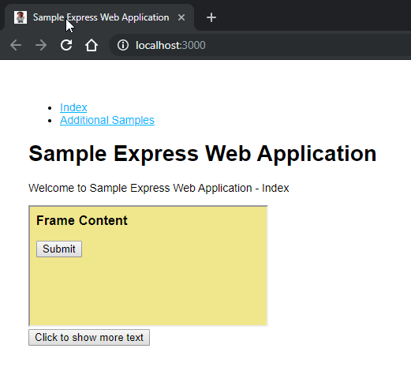

# Cucumber Boilerplate

Node.js Cucumber WebdriverIO Chromedriver and BrowserStack Boilerplate

Circle CI Build Status: [](https://circleci.com/gh/miroslawmajka/cucumber-boilerplate)

WebdriverIO API (ver. 5): https://webdriver.io/docs/api.html

Webdriver Protocol: https://webdriver.io/docs/api/webdriver.html

# Usage

Open your favourite CLI, like Git Bash in Windows and run the following commands:
```shell script
# Install "Sample Express App"
npm install -g sample-express-app

# Run "Sample Express App" in the background
sample-express-app > express.log &

# Installs dependencies
npm install

# Lints the JavaScript
npm run lint

# Runs the end-to-end testing using WebdriverIO Cucumber scenarios and closes down the app
npm test
```

Please see the specific `package.json` scripts and the `wdio-configs`
for details about running the tests locally using Chromedriver (with GUI or not) or
by delegating the testing effor to BrowserStack.

# Sample Express App

The "Sample Express App" is a standalone Node.js Express web application running at http://localhost:3000 that can be tested using Selenium. Sample screenshot below.



The views served by that application provide simple AJAX-like interaction and also an embedded iframe.

The Gherking test scenarios in the [sample-cucumber.feature](features/sample-cucumber.feature) file rely on this application running in the background.

The application is available at https://github.com/miroslawmajka/sample-express-app.

# TODO

* CrossBrowserTesting (https://webdriver.io/docs/crossbrowsertesting-service.html)
* Video Reporter (https://webdriver.io/docs/wdio-video-reporter.html)